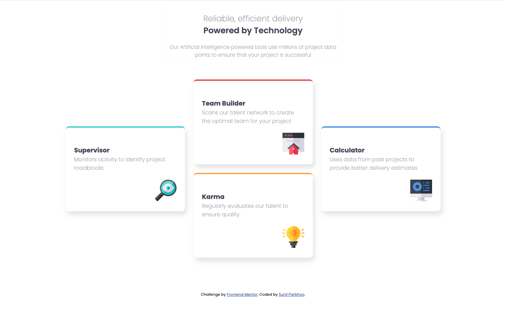
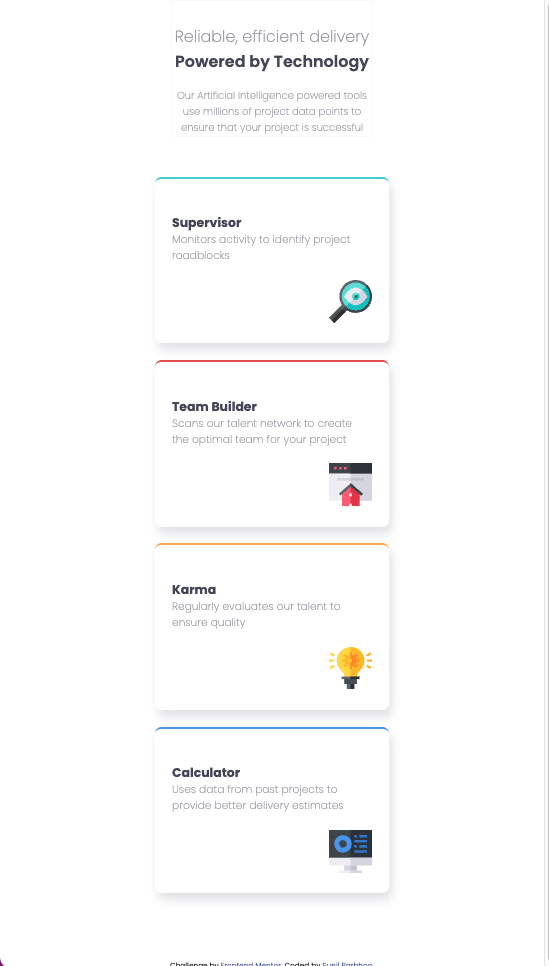

# Frontend Mentor - Four card feature section solution

This is a solution to the [Four card feature section challenge on Frontend Mentor](https://www.frontendmentor.io/challenges/four-card-feature-section-weK1eFYK). Frontend Mentor challenges help you improve your coding skills by building realistic projects.

## Table of contents

- [Frontend Mentor - Four card feature section solution](#frontend-mentor---four-card-feature-section-solution)
  - [Table of contents](#table-of-contents)
  - [Overview](#overview)
    - [The challenge](#the-challenge)
    - [Screenshot](#screenshot)
    - [Links](#links)
  - [My process](#my-process)
    - [Built with](#built-with)
    - [What I learned](#what-i-learned)
  - [Author](#author)

## Overview

### The challenge

Users should be able to:

- View the optimal layout for the site depending on their device's screen size

### Screenshot

### Links

- Solution URL: [Frontend Mentor Four Card Feature Section](https://www.frontendmentor.io/solutions/four-card-feature-section-responsive-jFj_Y1zmrM)
- Live Site URL: [Four Card Feature Section](https://sunilparbhoo.github.io/Frontend-Mentor---Four-Card-Feature-Section/)

## My process

This project was built using semantic HTML5 and CSS3 with a mobile first approach. I utilized flexbox, css grid, and media queries to develop the responsive page, and css custom properties for code organization.

### Built with

- Semantic HTML5 markup
- CSS custom properties
- Flexbox
- CSS Grid
- Mobile-first workflow

### What I learned

This was practice with developing using mobile first approach, creating a responsive static site utilizing flexbox and css grid along with media queries.

## Author

- GitHub - [Sunil Parbhoo](https://github.com/SunilParbhoo)
- Frontend Mentor - [@sunilparbhoo](https://www.frontendmentor.io/profile/sunilparbhoo)
